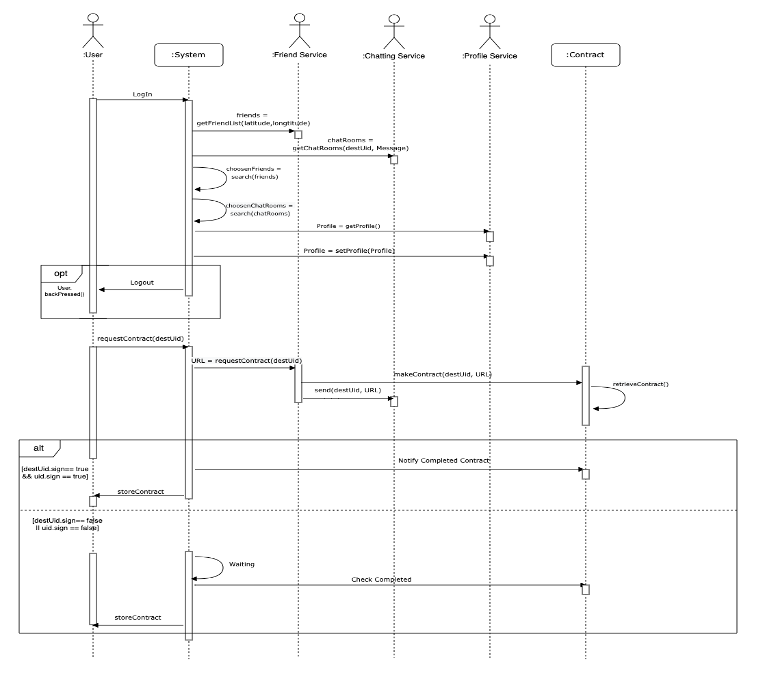
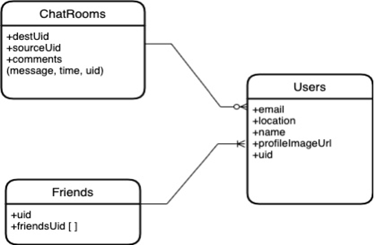
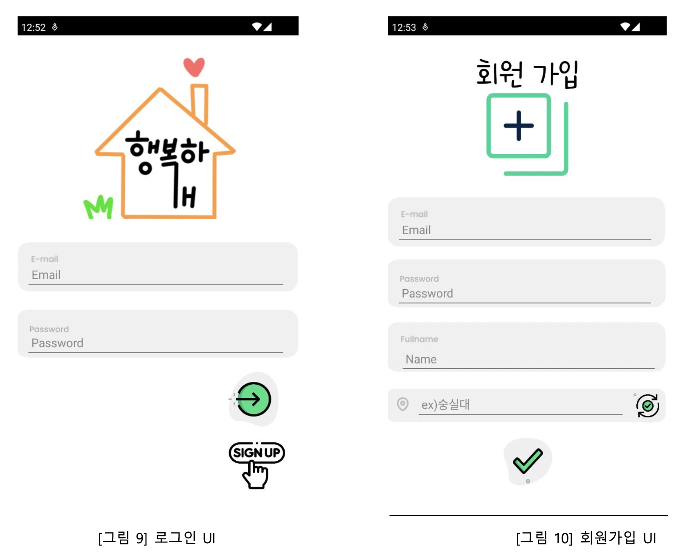
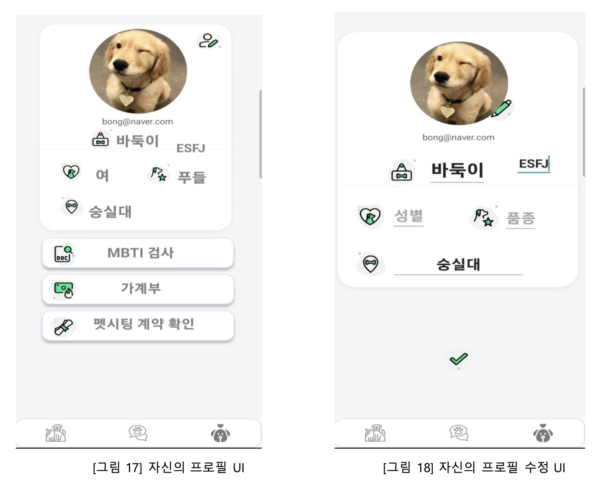
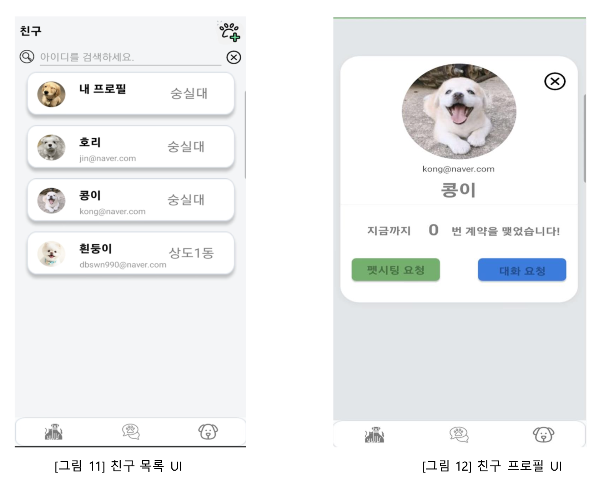
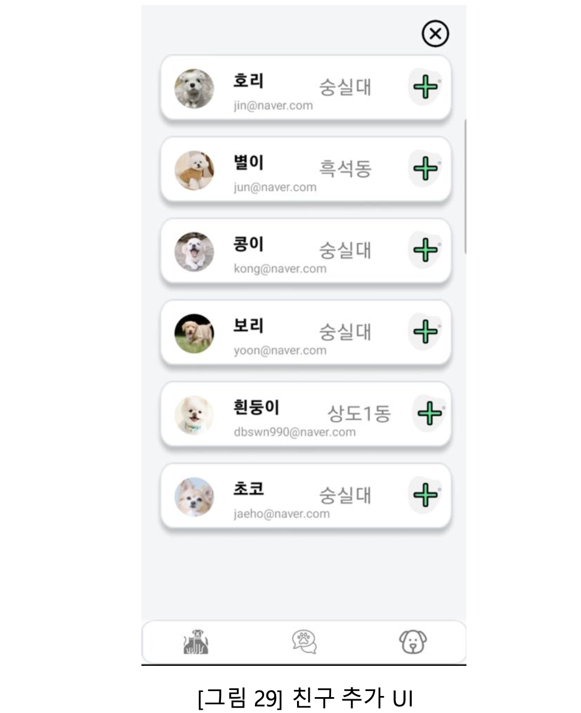
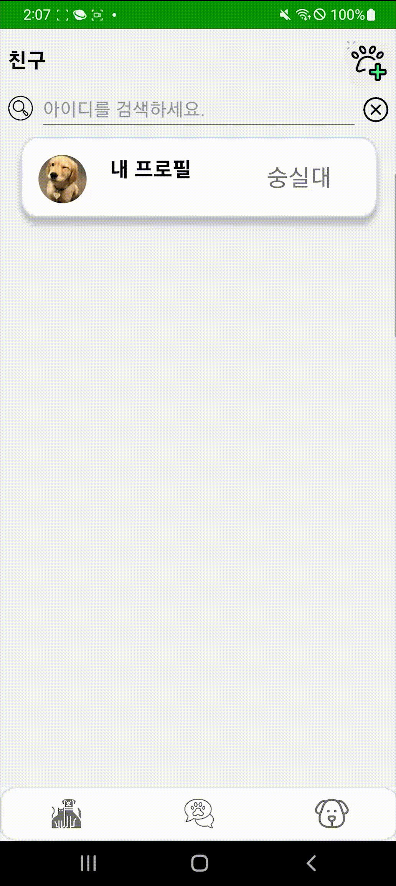

<h1> ️# 🐶HappyDog </h1>

## Kotlin + Firebase, RealTimeDatabase 기반의 어플리케이션

- 제작기간 : 2022.11.10 ~ 12.21

 

## 🛠사용 기술 & 개발 환경

- Kotlin
- Firebase, Real Time Database
- Gradle
- Android Studio
- Mac OS
- Retrofit2
- GeoCoder
- Spring boot

 

## 📌주요 키워드

- Kotlin 문법과 기초 학습 기회
- 별도 서버 없이 Firebase 사용과 RealTimeDatabase를 이용한 채팅 서비스 구현
- Firebase Authentication을 이용한 회원가입 및 로그인
- Firebase Storage를 이용한 프로필 이미지 저장 및 불러오기
- Retrofit2를 사용한 Rest API구현
- GeoCoder를 활용한 위도, 경도 추출

 

## 💣 Class Diagram
- ### Sequence Diagram
  

- ### ER Diagram
  

 

# <UI>

 . 
  
 . 

 . 

  . 

 

# 
 <시연 영상> 

 
 . 

